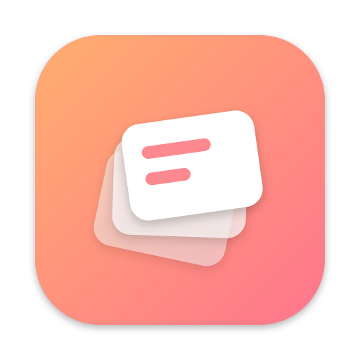
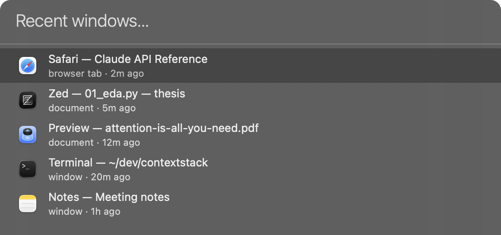
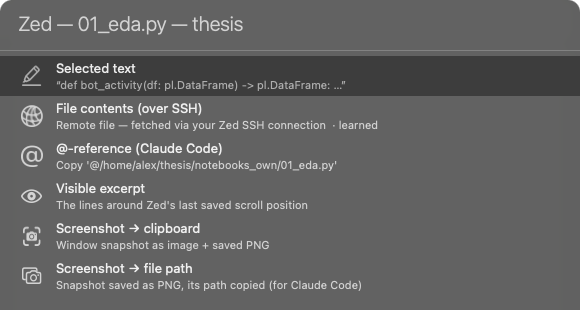
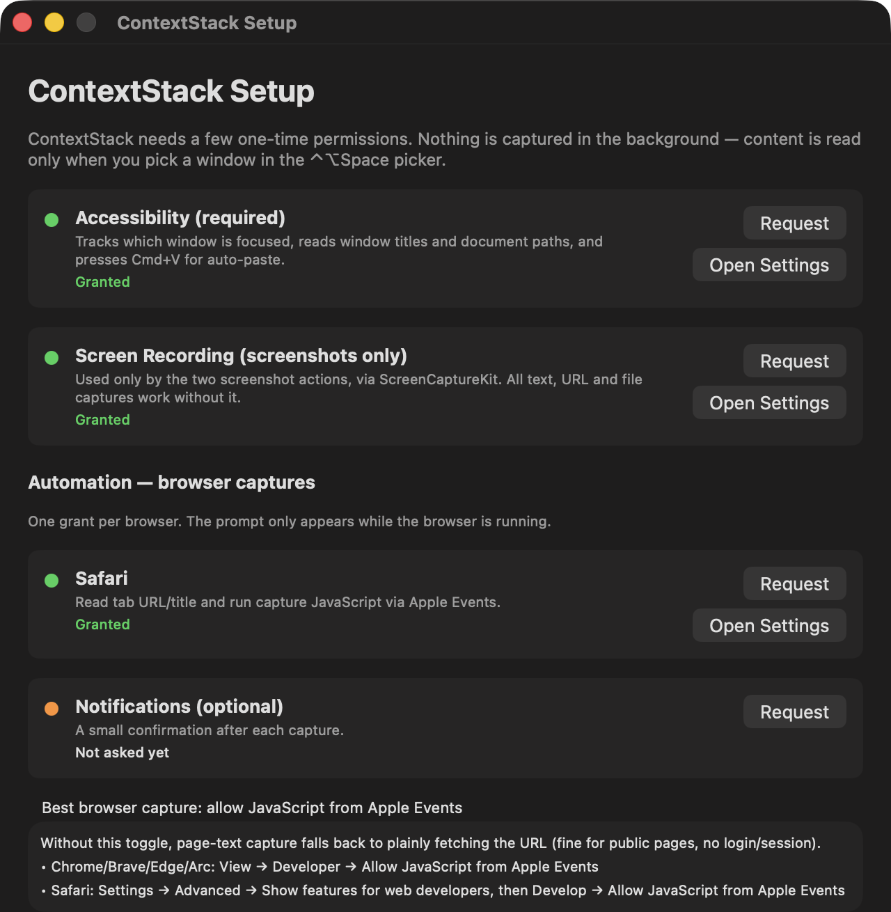

<p align="center">
  
</p>

<h1 align="center">ContextStack</h1>

<p align="center">
  <b>⌃⌥Space — grab what you just had on screen, pasted where you're typing.</b><br>
  A macOS menu-bar app for feeding context to AI chats.
</p>

---

You're chatting with Claude (desktop app or Claude Code) and need something
you just looked at — a web page, a PDF, a code file, a terminal. Instead of
alt-tabbing, selecting, copying, tabbing back: press **⌃⌥Space**, pick the
window, pick what to grab. It's pasted right where you were typing.

<p align="center"></p>

Pick a window, and ContextStack offers the best captures for what it is —
with the most likely one already on top, so **Enter-Enter** usually does it:

<p align="center"></p>

## What it can grab

| Source | Captures |
|---|---|
| **Browser tab** (Safari, Chrome, Arc, Brave, Edge, Vivaldi) | Rendered page text or full HTML — including logged-in pages and SPAs — via JavaScript in the tab; URL as a markdown link. Falls back to fetching the URL. |
| **Document window** (Preview, TextEdit, Xcode, Zed, …) | The file itself: contents, path, or `@path` for Claude Code. Resolved via Accessibility, window title, or Spotlight. |
| **Remote files over SSH** (Zed, VS Code, Cursor, JetBrains) | Remote file contents — ContextStack works out host and path from the editor's own session data or window title and fetches with `ssh`. |
| **Any window** | Screenshot (pasteable image + saved PNG) — works even for windows on other Spaces — or visible text via Accessibility. |
| **The relevant lines** | Text you *selected* in the source window (offered on top when a selection exists), or the **visible excerpt** — just what's scrolled into view, not the whole buffer. |

Every capture also lands in `~/ContextStack/` as a timestamped `.md`/`.png`
with a source header, so Claude Code can read it by path.

## It learns what you paste

The action list reorders itself around your habits: a tiny on-device model
(online softmax over context features) learns which capture you pick per
paste target, per app, and per project or site — one Zed project can settle
on `@-reference` while another prefers screenshots. It also rides your
bursts: what you just pasted feeds the next prediction, so five screenshots
in a row means the sixth is already on top, and recent habits outweigh old
ones. Better prediction, less selecting. The event log and model never leave
your machine; toggle *Smart action ranking* in the menu-bar menu, delete one
file to forget everything.

## Privacy, by construction

**Pointers, not recordings.** The history holds only window references,
titles and timestamps. Content is read at the moment you pick an entry —
never in the background, no database of your screen.

## Install

**Download:** grab the `.dmg` from
[Releases](https://github.com/BetterCallAlex/ContextStack/releases) and drag
ContextStack to Applications. On first launch macOS blocks apps from
unidentified developers (the build isn't notarized) — approve once under
System Settings → Privacy & Security → *Open Anyway*.

**Or build from source** — locally signed, no Gatekeeper step. Needs
macOS 14+ and the Xcode command-line tools (`xcode-select --install`).

```sh
git clone https://github.com/BetterCallAlex/ContextStack.git
cd ContextStack/ContextStackApp
./make-signing-cert.sh     # one-time: lets permission grants survive rebuilds
./build-app.sh install
open /Applications/ContextStack.app
```

The setup window opens on first launch: live status for each permission,
one-click prompts, and a reset for grants gone stale.

<p align="center"></p>

ContextStack uses the same permission model as Raycast or Alfred:
**Accessibility** (window tracking, auto-paste), **Automation** per browser
(tab capture), and **Screen Recording** only for the screenshot actions. For
logged-in pages, enable *Allow JavaScript from Apple Events* in your browser
once — the setup window shows how; without it, page capture falls back to a
plain URL fetch.

Build internals, config knobs, debug tooling, troubleshooting:
[ContextStackApp/README.md](ContextStackApp/README.md).

## Limitations

- **Firefox**: no AppleScript tab dictionary → no URL/page-text capture
  (screenshot and window text still work).
- **Electron apps** expose patchy accessibility trees → "window text" may be
  thin; use the screenshot action.
- SSH file contents need key-based auth for that host (never prompts).

## Roadmap

Browser-extension companion (exact tab identity, Firefox) · prefetch on
focus so closed tabs survive · pinned entries & multi-select · OCR for
screenshots.

## License

[MIT](LICENSE)
